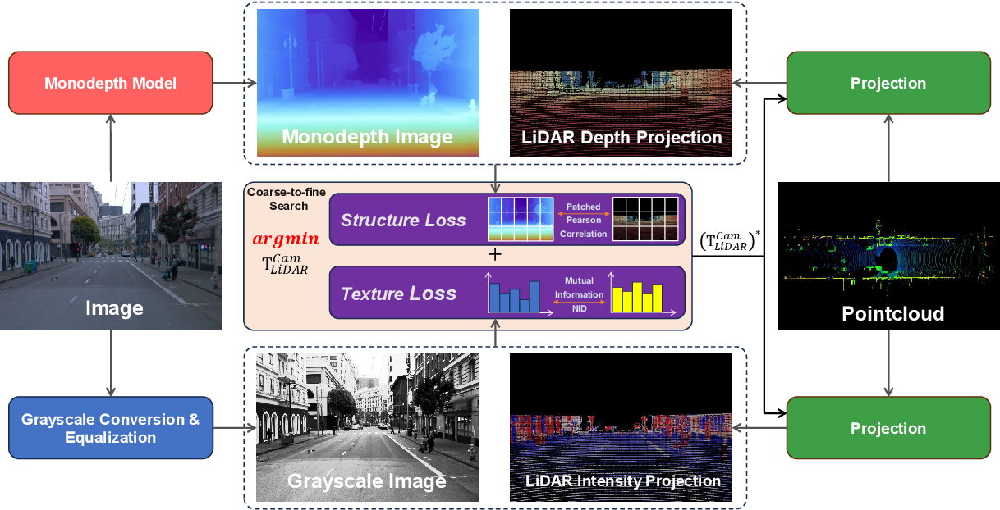
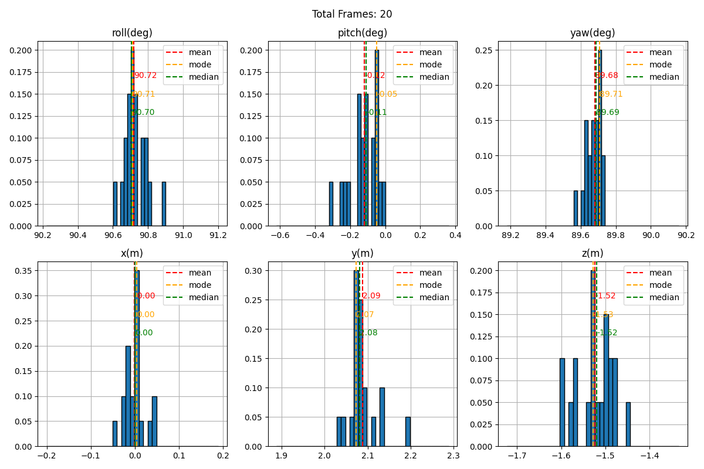
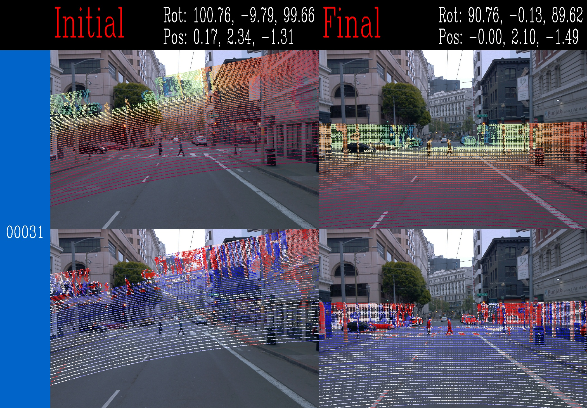
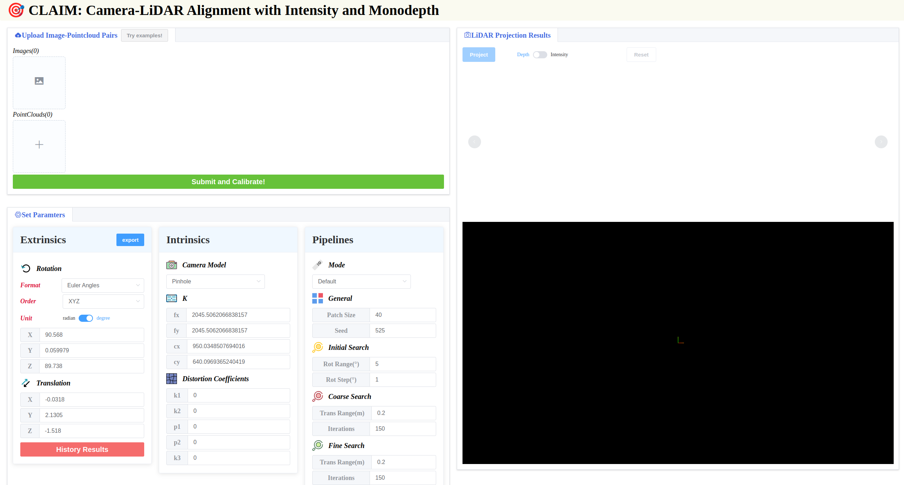

<div align="center">
<h1 style="border-bottom: none; margin-bottom: 0px ">CLAIM: Camera-LiDAR Alignment with Intensity and Monodepth</h1>

<h3> 2025 IEEE/RSJ International Conference on Intelligent Robots and Systems (IROS 2025) </h3>

<h4> 
Zhuo Zhang , Yonghui Liu , Meijie Zhang , Feiyang Tan and Yikang Ding
</h4>

<h4> 
Mach Drive
</h4>

<a href="https://arxiv.org/abs/2512.14001"></a>
<a href="https://ieeexplore.ieee.org/document/11247484"></a>

</div>

# Abstract
In this work, we unleash the potential of the powerful monodepth model in camera-LiDAR calibration and propose CLAIM, a novel method of aligning data from the camera and LiDAR. Given the initial guess and pairs of images and LiDAR point clouds, CLAIM utilizes a coarse-to-fine searching method to find the optimal transformation minimizing a patched Pearson correlation-based structure loss and a mutual information-based texture loss. These two losses serve as good metrics for camera-LiDAR alignment results and require no complicated steps of data processing, feature extraction, or feature matching like most methods, rendering our method simple and adaptive to most scenes.

<br>

# Contents
- ### [🚀 Quick Start](#quick_start)
- ### [😎 Test Your Dataset](#test_your_dataset)
- ### [🪟 Try with User Interface](#try_ui)
- ### [📝 Citations](#citations)
- ### [🙏 Acknowledgement](#acknowledgement)
⚠️ Note: The extrinsics mentioned in this page all refer to . we can use  to transform a point in LiDAR coordinate to camera coordinate.

<br>

 
# 🚀 Quick Start <span id="quick_start"></span>
## 👌 0. Prerequisites
* Ubuntu >= 18.04 
* CUDA >= 11.2
* GPU with [compute capability](https://developer.nvidia.com/cuda/gpus) >= 7.5

## 🏝️ 1. Clone & Create Environment  
```bash
git clone https://github.com/Tompson11/claim.git
cd claim
conda create -n claim python=3.10 -y
conda activate claim
cd claim
```

## 📦 2. Install dependencies
```bash
# install torch & torchvision (Notice that the versions of torch and cuda must match, here we take cuda 11.8 as example, )
pip install torch==2.0.0 torchvision==0.15.1 --index-url https://download.pytorch.org/whl/cu118

# install requirements
pip install -r backend/requirements.txt

# install lidar_image_align
pip install -e backend --no-build-isolation
```

## ⬇️ 3. Download DepthAnything-V2 checkpoint
```bash
wget -O backend/model/Depth_Anything_V2/ckpt/depth_anything_v2_vitl.pth https://huggingface.co/depth-anything/Depth-Anything-V2-Large/resolve/main/depth_anything_v2_vitl.pth\?download\=true
```

## 🏃‍♂️ 4. Try Waymo & KITTI examples
```bash 
python backend/api/calibrate_offline.py --config <CONFIG_FILE> --result_name results --vis_proj
```

We implement 4 useful calibration modes, please replace the `<CONFIG_FILE>` with the corresponding config file in the following table as you like:

<span id="table_mode"></span>
| Mode       | Comment | Waymo Config | KITTI config |
|------------|-------| ------| ------|
| **Default** | We add 10 $^{\circ}$ and $0.2m$ to the ground truth as the initial guess, and use the whole method in our paper to calibrate  | `backend/config/default_waymo.json`<br> `backend/config/default_watmo_4frames.json` (use 4 frames for a single calibration, i.e. CLAIM-4F* in our paper) | `backend/config/default_kitti.json`<br> `backend/config/default_kitti_4frames.json` (use 4 frames for a single calibration, i.e. CLAIM-4F* in our paper)
| **Finetune Both** | We add 1 $^{\circ}$ and $0.1m$ to the ground truth as the initial guess, and use the random search to calibrate  | `backend/config/finetune_both_waymo.json` | `backend/config/finetune_both_kitti.json`
| **Finetune Rotation** | We add 1 $^{\circ}$ to the ground truth as the initial guess, and use the grid search to calibrate rotation | `backend/config/finetune_rotation_waymo.json` | `backend/config/finetune_rotation_kitti.json`
| **Finetune Translation** | We add $0.1m$ to the ground truth as the initial guess, and use the random search to calibrate translation | `backend/config/finetune_translation_waymo.json` | `backend/config/finetune_translation_kitti.json`

The final results will be saved at `example_dataset/Waymo/results` or `example_dataset/KITTI/results` with the following directory structure:
```bash
results
├── analyzed_results.json
├── analyzed_results.png
├── results.json
├── proj
│   ├── 00000.jpg
│   ├── 00010.jpg
│   ├── 00021.jpg
|   ...
```
<span id="output_file"></span>
where each file represent:
* `results.json` : results of each calibration. It records the frame_id, initial guess and the final result of each calibration.  
* `analyzed_results.json` : statistics of `results.json`, including the mean, median, mode and quantile values. Usually, the mean or median value are recommended to be the final calibration result.
* `analyzed_results.png` : visualization image of `results.json` and `analyzed_results.json`. It shows the histogram of each component and the correponding statistics.

* `proj/XXXXX.jpg` : projection image of each calibration result. It shows the LiDAR depth projection (top) and LiDAR intensity projection (bottom) along with the initial guess and final calibration result. 



<br>

# 😎 Test Your Dataset <span id="test_your_dataset"></span>
## 💿 1. Prepare dataset
Organize your dataset like the provided example dataset in `example_dataset/KITTI` and `example_dataset/Waymo`. Your dataset should follow the directory structure:

```bash
YOUR_DATASET/
├── img/ # 
│   ├── 00000.jpg
│   └── 00001.jpg
|   ....
├── pcd/
│   ├── 00000.pcd
│   └── 00001.pcd
|   ....                                                                     
```
* Place your images under `img`. The image format should be either ".jpg" or ".png".
* Place your point clouds under `pcd`. The point cloud format should be either ".pcd" or ".ply". 
* The image and the point cloud with the same name are considered to be a time-synchronized pair and will be used for calibration.

## 🗒️ 2. Prepare configuration file
Create your own config file. You can refer to the corresponding [example config](#table_mode) according to your calibration situation. 

Here, we introduce each parameter in detail:
<table style="border-collapse:collapse;border-spacing:0" class="tg"><thead><tr><th style="background-color:#3531ff;border-color:inherit;border-style:solid;border-width:1px;color:#000000;font-family:Arial, sans-serif;font-size:20px;font-weight:bold;overflow:hidden;padding:10px 5px;text-align:center;vertical-align:top;word-break:normal" colspan="2"><span style="color:#FFF">Parameter</span></th><th style="background-color:#34696d;border-color:inherit;border-style:solid;border-width:1px;color:#000000;font-family:Arial, sans-serif;font-size:20px;font-weight:bold;overflow:hidden;padding:10px 5px;text-align:center;vertical-align:top;word-break:normal"><span style="color:#FFF">Meaning</span></th></tr></thead>
<tbody><tr><td style="background-color:#ffffc7;border-color:inherit;border-style:solid;border-width:1px;color:#000000;font-family:Arial, sans-serif;font-size:14px;font-weight:bold;overflow:hidden;padding:10px 5px;text-align:left;vertical-align:top;word-break:normal" colspan="2">base_dir</td><td style="background-color:#dae8fc;border-color:inherit;border-style:solid;border-width:1px;color:#000000;font-family:Arial, sans-serif;font-size:15px;overflow:hidden;padding:10px 5px;text-align:left;vertical-align:top;word-break:normal">root path of the dataset</td></tr>
<tr><td style="background-color:#ffffc7;border-color:inherit;border-style:solid;border-width:1px;color:#000000;font-family:Arial, sans-serif;font-size:14px;font-weight:bold;overflow:hidden;padding:10px 5px;text-align:left;vertical-align:top;word-break:normal" colspan="2">frame_nums_per_batch</td><td style="background-color:#dae8fc;border-color:inherit;border-style:solid;border-width:1px;color:#000000;font-family:Arial, sans-serif;font-size:15px;overflow:hidden;padding:10px 5px;text-align:left;vertical-align:top;word-break:normal">frame numbers used for a single calibration</td></tr>
<tr><td style="background-color:#ffffc7;border-color:inherit;border-style:solid;border-width:1px;color:#000000;font-family:Arial, sans-serif;font-size:14px;font-weight:bold;overflow:hidden;padding:10px 5px;text-align:left;vertical-align:top;word-break:normal" colspan="2">overlap_nums_between_batch</td><td style="background-color:#dae8fc;border-color:inherit;border-style:solid;border-width:1px;color:#000000;font-family:Arial, sans-serif;font-size:15px;overflow:hidden;padding:10px 5px;text-align:left;vertical-align:top;word-break:normal">overlapped frame numbers between two calibrations. <br><span style="font-style:italic">e.g. If there are 5 frames in the dataset, frame_nums_per_batch=3, overlap_nums_between_batch=1, then the first calibration will use the 0, 1, 2 frame and the second one will use 2, 3, 4 frame</span><br></td></tr>
<tr><td style="background-color:#9698ed;border-color:inherit;border-style:solid;border-width:1px;color:#000000;font-family:Arial, sans-serif;font-size:18px;font-weight:bold;overflow:hidden;padding:10px 5px;text-align:left;vertical-align:top;word-break:normal" rowspan="6"><span style="color:#FFF">data_params</span><br></td><td style="background-color:#ffffc7;color:#000000;border-color:inherit;border-style:solid;border-width:1px;font-family:Arial, sans-serif;font-size:14px;font-weight:bold;overflow:hidden;padding:10px 5px;text-align:left;vertical-align:top;word-break:normal">mono_depth_model</td><td style="background-color:#dae8fc;border-color:inherit;border-style:solid;border-width:1px;color:#000000;font-family:Arial, sans-serif;font-size:15px;overflow:hidden;padding:10px 5px;text-align:left;vertical-align:top;word-break:normal">model used to estimate mono depth, currently only "depth_anything_v2" is available.</td></tr>
<tr><td style="background-color:#ffffc7;color:#000000;border-color:inherit;border-style:solid;border-width:1px;font-family:Arial, sans-serif;font-size:14px;font-weight:bold;overflow:hidden;padding:10px 5px;text-align:left;vertical-align:top;word-break:normal">half_resolution</td><td style="background-color:#dae8fc;border-color:inherit;border-style:solid;border-width:1px;color:#000000;font-family:Arial, sans-serif;font-size:15px;overflow:hidden;padding:10px 5px;text-align:left;vertical-align:top;word-break:normal">whether to resize the original image to the half of its resolution. It is recommended to set "true" if your image size is larger than 1080p to save GPU memory and accelerate the calibration</td></tr>
<tr><td style="background-color:#ffffc7;color:#000000;border-color:inherit;border-style:solid;border-width:1px;font-family:Arial, sans-serif;font-size:14px;font-weight:bold;overflow:hidden;padding:10px 5px;text-align:left;vertical-align:top;word-break:normal">points_down_sample_step</td><td style="background-color:#dae8fc;border-color:inherit;border-style:solid;border-width:1px;color:#000000;font-family:Arial, sans-serif;font-size:15px;overflow:hidden;padding:10px 5px;text-align:left;vertical-align:top;word-break:normal">step to sample the point cloud. A large step is necessary if the point cloud is too large. <br><span style="font-style:italic">e.g. you can set points_down_sample_step to 2 if there are 2e6 points</span></td></tr>
<tr><td style="background-color:#ffffc7;color:#000000;border-color:inherit;border-style:solid;border-width:1px;font-family:Arial, sans-serif;font-size:14px;font-weight:bold;overflow:hidden;padding:10px 5px;text-align:left;vertical-align:top;word-break:normal">intensity_equalization</td><td style="background-color:#dae8fc;border-color:inherit;border-style:solid;border-width:1px;color:#000000;font-family:Arial, sans-serif;font-size:15px;overflow:hidden;padding:10px 5px;text-align:left;vertical-align:top;word-break:normal">whether to perform equalization on the point cloud intensity. "true" is recommended.</td></tr>
<tr><td style="background-color:#ffffc7;color:#000000;border-color:inherit;border-style:solid;border-width:1px;font-family:Arial, sans-serif;font-size:14px;font-weight:bold;overflow:hidden;padding:10px 5px;text-align:left;vertical-align:top;word-break:normal">gray_image_equalization</td><td style="background-color:#dae8fc;border-color:inherit;border-style:solid;border-width:1px;color:#000000;font-family:Arial, sans-serif;font-size:15px;overflow:hidden;padding:10px 5px;text-align:left;vertical-align:top;word-break:normal">whether to perform histogram equalization on the grayscale image. "true" is recommended.</td></tr>
<tr><td style="background-color:#ffffc7;color:#000000;border-color:inherit;border-style:solid;border-width:1px;font-family:Arial, sans-serif;font-size:14px;font-weight:bold;overflow:hidden;padding:10px 5px;text-align:left;vertical-align:top;word-break:normal">shuffle</td><td style="background-color:#dae8fc;border-color:inherit;border-style:solid;border-width:1px;color:#000000;font-family:Arial, sans-serif;font-size:15px;overflow:hidden;padding:10px 5px;text-align:left;vertical-align:top;word-break:normal">whether to shuffle the dataset. This matters if you use multi frames for calibration.</td></tr>
<tr><td style="background-color:#9698ed;border-color:inherit;border-style:solid;border-width:1px;color:#000000;font-family:Arial, sans-serif;font-size:18px;font-weight:bold;overflow:hidden;padding:10px 5px;text-align:left;vertical-align:top;word-break:normal" rowspan="12"><span style="color:#FFF">pipeline_params</span><br></td><td style="background-color:#ffffc7;color:#000000;border-color:inherit;border-style:solid;border-width:1px;font-family:Arial, sans-serif;font-size:16px;font-weight:bold;overflow:hidden;padding:10px 5px;text-align:left;vertical-align:top;word-break:normal">mode</td>
<td style="background-color:#dae8fc;border-color:inherit;border-style:solid;border-width:1px;color:#000000;font-family:Arial, sans-serif;font-size:15px;overflow:hidden;padding:10px 5px;text-align:left;vertical-align:top;word-break:normal">calibration mode<br><span style="font-style:italic">0: default</span><br><span style="font-style:italic">1: finetune both</span><br><span style="font-style:italic">2: finetune rotation</span><br><span style="font-style:italic">3: finetune translation</span></td></tr>
<tr><td style="background-color:#ffffc7;color:#000000;border-color:inherit;border-style:solid;border-width:1px;font-family:Arial, sans-serif;font-size:16px;font-weight:bold;overflow:hidden;padding:10px 5px;text-align:left;vertical-align:top;word-break:normal">patch_size</td><td style="background-color:#dae8fc;border-color:inherit;border-style:solid;border-width:1px;color:#000000;font-family:Arial, sans-serif;font-size:15px;overflow:hidden;padding:10px 5px;text-align:left;vertical-align:top;word-break:normal">patch size to divide the image for structure loss calculation. Usually the value of patch_size dividing the image width falls within [20, 40] will be fine.</td></tr>
<tr><td style="background-color:#ffffc7;color:#000000;border-color:inherit;border-style:solid;border-width:1px;font-family:Arial, sans-serif;font-size:16px;font-weight:bold;overflow:hidden;padding:10px 5px;text-align:left;vertical-align:top;word-break:normal">init_rot_range</td><td style="background-color:#dae8fc;border-color:inherit;border-style:solid;border-width:1px;color:#000000;font-family:Arial, sans-serif;font-size:15px;overflow:hidden;padding:10px 5px;text-align:left;vertical-align:top;word-break:normal">rotation search range for initial grid search (unit: degree). Set it to the estimated rotation error of the initial guess.  (This parameter is useful only when the mode=0.)</td></tr>
<tr><td style="background-color:#ffffc7;color:#000000;border-color:inherit;border-style:solid;border-width:1px;font-family:Arial, sans-serif;font-size:16px;font-weight:bold;overflow:hidden;padding:10px 5px;text-align:left;vertical-align:top;word-break:normal">init_rot_resolution</td><td style="background-color:#dae8fc;border-color:inherit;border-style:solid;border-width:1px;color:#000000;font-family:Arial, sans-serif;font-size:15px;overflow:hidden;padding:10px 5px;text-align:left;vertical-align:top;word-break:normal">rotation search resolution for initial grid search (unit: degree). Set it to a feasible value according to the init_rot_range. (This parameter is useful only when the mode=0.)<br><span style="font-style:italic">e.g.  init_rot_range=10, init_rot_resolution=1; or init_rot_range=5, init_rot_resolution=0.5</span></td></tr>
<tr><td style="background-color:#ffffc7;color:#000000;border-color:inherit;border-style:solid;border-width:1px;font-family:Arial, sans-serif;font-size:16px;font-weight:bold;overflow:hidden;padding:10px 5px;text-align:left;vertical-align:top;word-break:normal">coarse_trans_range</td><td style="background-color:#dae8fc;border-color:inherit;border-style:solid;border-width:1px;color:#000000;font-family:Arial, sans-serif;font-size:15px;overflow:hidden;padding:10px 5px;text-align:left;vertical-align:top;word-break:normal">translation search range for coarse random search (unit: meter).  Set it to the estimated translation error of the initial guess. (This parameter is useful only when the mode=0.)</td></tr>
<tr><td style="background-color:#ffffc7;color:#000000;border-color:inherit;border-style:solid;border-width:1px;font-family:Arial, sans-serif;font-size:16px;font-weight:bold;overflow:hidden;padding:10px 5px;text-align:left;vertical-align:top;word-break:normal">coarse_iters</td><td style="background-color:#dae8fc;border-color:inherit;border-style:solid;border-width:1px;color:#000000;font-family:Arial, sans-serif;font-size:15px;overflow:hidden;padding:10px 5px;text-align:left;vertical-align:top;word-break:normal">iterations for coarse random search. (This parameter is useful only when the mode=0.)</td></tr>
<tr><td style="background-color:#ffffc7;color:#000000;border-color:inherit;border-style:solid;border-width:1px;font-family:Arial, sans-serif;font-size:16px;font-weight:bold;overflow:hidden;padding:10px 5px;text-align:left;vertical-align:top;word-break:normal">search_mode</td><td style="background-color:#dae8fc;border-color:inherit;border-style:solid;border-width:1px;color:#000000;font-family:Arial, sans-serif;font-size:15px;overflow:hidden;padding:10px 5px;text-align:left;vertical-align:top;word-break:normal">search mode for finetune. (This parameter is useful when the mode=2,3.)<br><span style="font-style:italic">0: random search</span><br><span style="font-style:italic">1: grid search</span></td></tr>
<tr><td style="background-color:#ffffc7;color:#000000;border-color:inherit;border-style:solid;border-width:1px;font-family:Arial, sans-serif;font-size:16px;overflow:hidden;padding:10px 5px;text-align:left;vertical-align:top;word-break:normal"><span style="font-weight:bold">fine_trans_range</span></td><td style="background-color:#dae8fc;border-color:inherit;border-style:solid;border-width:1px;color:#000000;font-family:Arial, sans-serif;font-size:15px;overflow:hidden;padding:10px 5px;text-align:left;vertical-align:top;word-break:normal">translation search range for fine random search (unit: meter).  (This parameter is useful when the mode=0,1,3.)</td></tr>
<tr><td style="background-color:#ffffc7;color:#000000;border-color:inherit;border-style:solid;border-width:1px;font-family:Arial, sans-serif;font-size:16px;font-weight:bold;overflow:hidden;padding:10px 5px;text-align:left;vertical-align:top;word-break:normal">fine_rot_range</td><td style="background-color:#dae8fc;border-color:inherit;border-style:solid;border-width:1px;color:#000000;font-family:Arial, sans-serif;font-size:15px;overflow:hidden;padding:10px 5px;text-align:left;vertical-align:top;word-break:normal">rotation search range for fine random search (unit: meter).  (This parameter is useful when the mode=0,1.)</td></tr>
<tr><td style="background-color:#ffffc7;color:#000000;border-color:inherit;border-style:solid;border-width:1px;font-family:Arial, sans-serif;font-size:16px;font-weight:bold;overflow:hidden;padding:10px 5px;text-align:left;vertical-align:top;word-break:normal">fine_iters</td><td style="background-color:#dae8fc;border-color:inherit;border-style:solid;border-width:1px;color:#000000;font-family:Arial, sans-serif;font-size:15px;overflow:hidden;padding:10px 5px;text-align:left;vertical-align:top;word-break:normal">iterations for fine random search.  (This parameter is useful only when the search_mode=0.)</td></tr>
<tr><td style="background-color:#ffffc7;color:#000000;border-color:inherit;border-style:solid;border-width:1px;font-family:Arial, sans-serif;font-size:16px;font-weight:bold;overflow:hidden;padding:10px 5px;text-align:left;vertical-align:top;word-break:normal">fine_trans_resolution</td><td style="background-color:#dae8fc;border-color:inherit;border-style:solid;border-width:1px;color:#000000;font-family:Arial, sans-serif;font-size:15px;overflow:hidden;padding:10px 5px;text-align:left;vertical-align:top;word-break:normal">translation search range for finetuning grid search (unit: degree).  (This parameter is useful only when the mode=3 &amp; search_mode=1.)</td></tr>
<tr><td style="background-color:#ffffc7;color:#000000;border-color:inherit;border-style:solid;border-width:1px;font-family:Arial, sans-serif;font-size:16px;font-weight:bold;overflow:hidden;padding:10px 5px;text-align:left;vertical-align:top;word-break:normal">fine_rot_resolution</td><td style="background-color:#dae8fc;border-color:inherit;border-style:solid;border-width:1px;color:#000000;font-family:Arial, sans-serif;font-size:15px;overflow:hidden;padding:10px 5px;text-align:left;vertical-align:top;word-break:normal">rotation search range for finetuning grid search (unit: degree).  (This parameter is useful only when the mode=2 &amp; search_mode=1.)</td></tr>
<tr><td style="background-color:#9698ed;border-color:inherit;border-style:solid;border-width:1px;color:#000000;font-family:Arial, sans-serif;font-size:18px;font-weight:bold;overflow:hidden;padding:10px 5px;text-align:left;vertical-align:top;word-break:normal" rowspan="2"><span style="color:#FFF">intrinsics</span></td><td style="background-color:#ffffc7;color:#000000;border-color:inherit;border-style:solid;border-width:1px;font-family:Arial, sans-serif;font-size:16px;font-weight:bold;overflow:hidden;padding:10px 5px;text-align:left;vertical-align:top;word-break:normal">K</td><td style="background-color:#dae8fc;border-color:inherit;border-style:solid;border-width:1px;color:#000000;font-family:Arial, sans-serif;font-size:15px;overflow:hidden;padding:10px 5px;text-align:left;vertical-align:top;word-break:normal">intrinsic value of the camera. The format must be [fx, fy, cx, cy]</td></tr>
<tr><td style="background-color:#ffffc7;color:#000000;border-color:inherit;border-style:solid;border-width:1px;font-family:Arial, sans-serif;font-size:16px;font-weight:bold;overflow:hidden;padding:10px 5px;text-align:left;vertical-align:top;word-break:normal">D</td><td style="background-color:#dae8fc;border-color:inherit;border-style:solid;border-width:1px;color:#000000;font-family:Arial, sans-serif;font-size:15px;overflow:hidden;padding:10px 5px;text-align:left;vertical-align:top;word-break:normal">distortion coefficients of the camera. The format must be [k1, k2, p1, p2, k3] for pinhole or [k1, k2, k3, k4] for fisheye </td></tr>
<tr><td style="background-color:#9698ed;border-color:inherit;border-style:solid;border-width:1px;color:#000000;font-family:Arial, sans-serif;font-size:18px;font-weight:bold;overflow:hidden;padding:10px 5px;text-align:left;vertical-align:top;word-break:normal" rowspan="2"><span style="color:#FFF">extrinsics</span></td><td style="background-color:#ffffc7;color:#000000;border-color:inherit;border-style:solid;border-width:1px;font-family:Arial, sans-serif;font-size:16px;font-weight:bold;overflow:hidden;padding:10px 5px;text-align:left;vertical-align:top;word-break:normal">translation</td><td style="background-color:#dae8fc;border-color:inherit;border-style:solid;border-width:1px;color:#000000;font-family:Arial, sans-serif;font-size:15px;overflow:hidden;padding:10px 5px;text-align:left;vertical-align:top;word-break:normal">translation of the initial guess (unit: meter). </td></tr>
<tr><td style="background-color:#ffffc7;color:#000000;border-color:inherit;border-style:solid;border-width:1px;font-family:Arial, sans-serif;font-size:16px;font-weight:bold;overflow:hidden;padding:10px 5px;text-align:left;vertical-align:top;word-break:normal">rotation</td><td style="background-color:#dae8fc;border-color:inherit;border-style:solid;border-width:1px;color:#000000;font-family:Arial, sans-serif;font-size:15px;overflow:hidden;padding:10px 5px;text-align:left;vertical-align:top;word-break:normal">rotation of the initial guess (unit: meter). It must be quaternion format: [qw, qx, qy, qz]</td></tr></tbody></table>

## 🏃‍♂️ 3. Run
```bash
python backend/api/calibrate_offline.py \
--config <CONFIG_FILE> \
--seed <SEED> \
--result_name <RESULT_NAME> \
--vis_proj
```
The meanings of the parameters are:
* **config**: Config file.
* **seed**: Random seed. You can set a non-negative seed ($0$ ~ $2^{32}-1$) for reproducible results, or a negative seed for diverse results. Default seed will be used if the parameter is omitted.
* **result_name**: Name of the result directory. The final result will be saved at `<YOUR_DATASET>/<RESULT_NAME>`. The default value is "result".
* **vis_proj**: whether to save the visualization results.

You can find the results at `<YOUR_DATASET>/<RESULT_NAME>`, where the content of each file can be refered to [contents](#output_file).

<br>

# 🪟 Try with User Interface (Recommended) <span id="try_ui">
## 📦 1. Install dependencies
```bash
# install requirements
pip install -r frontend/claim_frontend/requirements.txt
```

## 👾 2. Run Django server
```bash
cd frontend/claim_frontend
python3 manage.py runserver 0.0.0.0:8080
```

## 📭 3. Set up port forwarding (if necessary) 
If you deploy CLAIM on a server without display, you need a local computer to display the user interface. So, set up port forwarding by executing the following command on your local computer, where `<HOSTNAME_OF_SERVER>` is the hostname of your server.
```bash
ssh -N -L 8080:127.0.0.1:8080 <HOSTNAME_OF_SERVER>
```

## 🖥️ 4. Open the User Interface
Open the browser on your local computer and enter `http://127.0.0.1:8080/index/`, then you will see the following page.


## 🎮 5. Explore the User Interface
The common usage is:
* **step1** : Upload images and point clouds. Note that their numbers must be equal and the correponding pairs must have the identical index. The supported formats for images are "jpg" and "png" and for point clouds are "ply" and "pcd".
* **step2** : Set configuration parameters. Fill in the extrinsics (i.e. initial guess), intrinsics and pipeline parameters according to your situation. The meaning of these parameters can be referred to [paramters](#param).
* **step3** : Click the `Submit and Calibrate!` button and wait for the calibration. When the calibration completes, there will be a notice popping at the top-right of the window and the calibrated extrinsics will replace the initial guess. If you want to retrieve your initial guess or see the previous calibration results, you can click the `History Results` button.
* **step4** : View the projection results. Click the `Project` button to project LiDAR points onto the image with the current extrinsics. Switch the `depth/intensity` buttion to change the color attribute. Also, you can see the colored point cloud in the black windows.
* **step5** : Export the results. Click the `Export` button to download the current extrinsics as a json file.


Some tips:
* **Try Examples** : Click the `Try Examples!` button and select the provided KITTI/Waymo frames. The extrinsics and intrinsics will be filled with the ground truth and you can add some perturbation on the extrinsics to test.
* **Tune Extrinsics** : You can also use our user interface as a platform for manual calibration by repeatedly tuning the extrinsics and viewing the projection results. You can zoom in/out with the mousewheel when the mouse hovers on the projection picture. You can also drag the pointcloud for better visualization.

<br>

# 📝 Citations <span id="citations">
If you find CLAIM useful in your research or projects, please cite our work:

```Latex
@INPROCEEDINGS{11247484,
  author={Zhang, Zhuo and Liu, Yonghui and Zhang, Meijie and Tan, Feiyang and Ding, Yikang},
  booktitle={2025 IEEE/RSJ International Conference on Intelligent Robots and Systems (IROS)}, 
  title={CLAIM: Camera-LiDAR Alignment with Intensity and Monodepth}, 
  year={2025},
  volume={},
  number={},
  pages={17921-17926},
  doi={10.1109/IROS60139.2025.11247484}}
```

<br>

# 🙏 Acknowledgement <span id="acknowledgement"></span>
* CLAIM draws inspirations from [SparseGS](https://github.com/ForMyCat/SparseGS) and [direct_visual_lidar_calibration](https://github.com/koide3/direct_visual_lidar_calibration).
* CLAIM uses [DepthAnything-V2](https://github.com/DepthAnything/Depth-Anything-V2) for its excellent performance.
* CLAIM uses these great public datasets: [KITTI](https://www.cvlibs.net/datasets/kitti/), [Waymo](https://waymo.com/open/) and [MIAS-LECE](https://github.com/ZWhuang666/MIAS-LCEC).